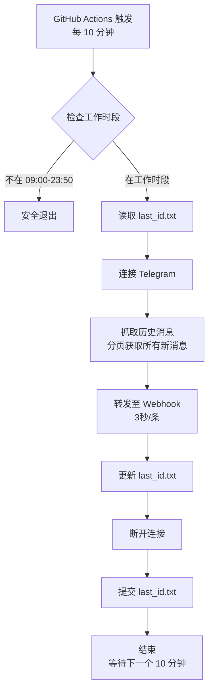

# Telegram 私密群组消息转发器

基于 MTProto 协议的 Telegram 消息监控系统，专为 GitHub Actions 部署优化，可将私密群组消息转发至飞书/企业微信。

## ✨ 核心特性

- 🔐 **StringSession 认证**：无需本地 `.session` 文件，完全基于环境变量
- ⏰ **智能时间窗口**：仅在北京时间 09:00-23:50 运行
- 📨 **历史消息补发**：自动补发运行间隙产生的消息，支持分页获取（无消息丢失）
- 🔄 **轻量级轮询**：每 10 分钟执行一次，抓完即退出（替代长连接监听）
- 💾 **状态持久化**：自动保存并提交最后处理的消息 ID
- ⚡ **配额优化**：每月仅消耗约 180 分钟（节省 76% 配额）
- 🛡️ **并发控制**：自动排队机制，防止多任务冲突
- 🔥 **超时熔断**：5 分钟超时自动清理，让新任务接管
- 📊 **实时日志**：禁用 Python 输出缓冲，可在 Actions 控制台实时查看运行状态
- 🌐 **海外网络**：利用 GitHub Actions 环境绕过网络限制
- 🚦 **严格频率限制**：3 秒/条（20条/分钟），防止 Webhook 限流封禁
- 💨 **异步 I/O 优化**：使用 aiohttp 避免阻塞，保持 Telegram 连接稳定

## 📋 前置准备

### 1. 获取 Telegram API 凭据

1. 访问 [https://my.telegram.org/apps](https://my.telegram.org/apps)
2. 使用你的手机号登录
3. 创建一个新应用（如果还没有）
4. 记录 `api_id` 和 `api_hash`

### 2. 获取私密群组 ID

有两种方法获取群组 ID：

#### 方法一：使用 Telegram 桌面客户端（推荐）

1. 打开 Telegram 桌面版
2. 进入目标群组
3. 查看浏览器地址栏或群组链接
4. 格式通常为：`https://t.me/c/1234567890/1`
5. 其中 `1234567890` 就是群组 ID（需要在前面加上 `-100`）
6. 最终 ID 为：`-1001234567890`

#### 方法二：使用 Python 脚本

```python
from telethon.sync import TelegramClient

api_id = YOUR_API_ID
api_hash = 'YOUR_API_HASH'

with TelegramClient('session_name', api_id, api_hash) as client:
    for dialog in client.iter_dialogs():
        print(f'{dialog.name}: {dialog.id}')
```

### 3. 生成 StringSession

在本地运行以下命令：

```bash
# 安装依赖
pip install telethon

# 运行生成工具
python gen_session.py
```

按提示输入：
- API_ID
- API_HASH
- 手机号（国际格式，如 +8613800138000）
- 验证码
- 两步验证密码（如果启用了）

成功后会输出 StringSession 字符串，**请妥善保管**！

### 4. 获取 Webhook URL

系统支持三种机器人平台，会**自动识别**并使用对应的消息格式：

#### 钉钉机器人（推荐）

1. 在钉钉群组中点击右上角 `···` > `群设置` > `智能群助手`
2. 点击 `添加机器人` > `自定义`
3. 设置机器人名称（如"TG 监控"）
4. **安全设置**：选择"自定义关键词"，输入：`TG` 或 `监控`
5. 复制 Webhook URL（格式：`https://oapi.dingtalk.com/robot/send?access_token=...`）

#### 飞书机器人

1. 在飞书群组中添加自定义机器人
2. 获取 Webhook URL（格式：`https://open.feishu.cn/open-apis/bot/v2/hook/...`）

#### 企业微信机器人

1. 在企业微信群组中添加群机器人
2. 获取 Webhook URL（格式：`https://qyapi.weixin.qq.com/cgi-bin/webhook/send?key=...`）

**注意**：脚本会根据 URL 自动识别平台类型并使用对应的消息格式，无需额外配置。

## 🚀 部署到 GitHub Actions

### 1. 创建 GitHub 仓库

```bash
git init
git add .
git commit -m "Initial commit"
git branch -M main
git remote add origin https://github.com/YOUR_USERNAME/telegram-monitor.git
git push -u origin main
```

### 2. 配置 GitHub Secrets

进入仓库的 `Settings` > `Secrets and variables` > `Actions`，点击 `New repository secret`，添加以下密钥：

| Secret 名称 | 说明 | 示例值 |
|------------|------|--------|
| `API_ID` | Telegram API ID | `12345678` |
| `API_HASH` | Telegram API Hash | `abcdef1234567890abcdef1234567890` |
| `STRING_SESSION` | 通过 gen_session.py 生成的字符串 | `1AQAOMTQ5LjE1NC4x...` |
| `TG_CHAT_ID` | 目标群组 ID（负数） | `-1001234567890` |
| `WEBHOOK_URL` | 钉钉/飞书/企微 Webhook 地址 | `https://oapi.dingtalk.com/robot/send?access_token=...` |

### 3. 启用 GitHub Actions

1. 进入仓库的 `Actions` 标签页
2. 如果提示启用 Workflows，点击 `I understand my workflows, go ahead and enable them`
3. 工作流将自动按计划运行

### 4. 手动触发测试

1. 进入 `Actions` 标签页
2. 选择 `Telegram Monitor` 工作流
3. 点击 `Run workflow` > `Run workflow`
4. 查看运行日志确认是否正常

## 📊 运行逻辑

### 新架构：轻量级轮询模式



### 并发控制机制

```
时间轴示例（假设网络极差）：

09:00 ─ 任务 A 启动
09:03 ─ 任务 A 仍在运行（处理大量消息）
09:05 ─ 任务 A 超时，被强制杀死
09:10 ─ 任务 B 启动（读取到 08:50 的 last_id）
09:12 ─ 任务 B 完成（一次性处理 08:50-09:10 的所有消息）
09:20 ─ 任务 C 启动（正常运行）
```

**关键保护**：
- `concurrency.cancel-in-progress: false` → 新任务排队，不会并行
- `timeout-minutes: 5` → 超时自动清理
- 无文件锁冲突，无数据丢失

## 🔧 本地测试

如果需要在本地测试（不推荐用于生产）：

```bash
# 1. 安装依赖
pip install -r requirements.txt

# 2. 设置环境变量（Linux/macOS）
export API_ID="12345678"
export API_HASH="your_api_hash"
export STRING_SESSION="your_string_session"
export TG_CHAT_ID="-1001234567890"
export WEBHOOK_URL="your_webhook_url"

# 3. 运行脚本
python main.py
```

Windows PowerShell：

```powershell
$env:API_ID="12345678"
$env:API_HASH="your_api_hash"
$env:STRING_SESSION="your_string_session"
$env:TG_CHAT_ID="-1001234567890"
$env:WEBHOOK_URL="your_webhook_url"
python main.py
```

## 📝 消息格式示例

### 钉钉机器人

```markdown
### 🔔 TG 群组监控告警

**发送者：** 张三

**时间：** 2026-02-07 14:30:25

**内容：**

大家好，今天的会议改到下午3点。
```

### 飞书/企业微信

```
🔔 TG 群组监控告警

【发送者】张三
【时间】2026-02-07 14:30:25
【内容】
大家好，今天的会议改到下午3点。
```

## ⚠️ 注意事项

### 安全性

1. **绝不要**将 `STRING_SESSION` 提交到 Git 仓库
2. **绝不要**在公开场合分享你的 API 凭据
3. 如果 `STRING_SESSION` 泄露，立即在 Telegram 中登出所有会话
4. 定期检查 GitHub Secrets 的访问权限

### 限制

1. **GitHub Actions 配额（已大幅优化）**：
   - 免费账户每月 2000 分钟
   - **原方案**：15 次/天 × 50 分钟 = 750 分钟/月
   - **新方案**：90 次/天 × 2 分钟 ≈ **180 分钟/月**
   - **节省 76% 配额！**
   - **已内置保护**：
     - 脚本层面：单次执行 < 5 分钟
     - Actions 层面：5 分钟强制超时（防止卡死）
     - 并发控制：自动排队，防止多任务冲突

2. **时间覆盖**：
   - 运行时段：北京时间 09:00-23:50（每 10 分钟一次）
   - **23:50-09:00 的消息**：次日 09:00 补发
   - 无数据丢失，最多延迟 10 小时 10 分钟
   - 如需 24 小时覆盖，可调整 Cron 为 `0,10,20,30,40,50 * * * *`（每月约 4320 分钟，超出免费额度）

3. **Telegram API 限制**：
   - 避免频繁请求，已内置延迟机制
   - 如遇限流，脚本会自动处理

4. **Webhook 限流**：
   - **钉钉**：每个机器人每分钟最多 20 条消息
   - **飞书**：每个机器人每分钟最多 20 条消息
   - **企业微信**：每个机器人每分钟最多 20 条消息
   - **已内置保护**：脚本自动以 3 秒/条的速度发送，严格遵守限制

### 故障排查

#### 1. Actions 运行失败

- 检查 Secrets 是否正确配置
- 查看 Actions 日志中的错误信息
- 确认 `STRING_SESSION` 未过期

#### 2. 消息未转发

- 确认 `TG_CHAT_ID` 正确（注意负号）
- 检查 Webhook URL 是否有效
- 查看 Actions 日志中的 Webhook 响应

#### 3. 重复消息

- 检查 `last_id.txt` 是否正确提交
- 确认 GitHub Actions 有写入权限

## 📄 许可证

MIT License

## 🤝 贡献

欢迎提交 Issue 和 Pull Request！

## 📧 联系方式

如有问题，请在 GitHub Issues 中提出。
